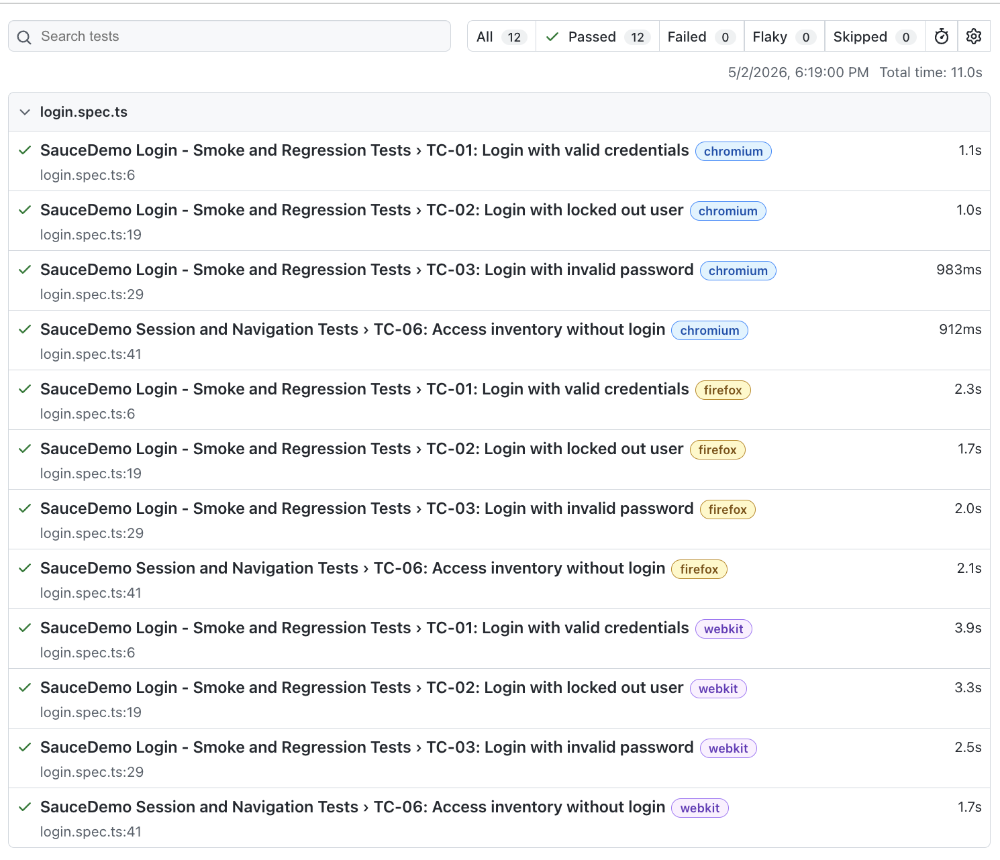

# Playwright UI Automation – SauceDemo

## Overview
This project showcases automated end-to-end testing with Playwright. It mirrors real-world QA practices by including structured test design, reusable automation, and cross-browser validation.

### Key Features
- End-to-end UI test automation using Playwright
- Page Object Model (POM) for maintainability
- Cross-browser testing (Chromium, Firefox, webkit)
- Reusable test methods (login, abstraction)
- Clear test case structure with QA IDs (TC-XX)
- Automated HTML reporting

## Assumptions
- Application under test is stable and publicly accessible
- Test data is static (provided by SauceDemo)

## Test Scope / Covered Scenarios
High-priority login and session scenarios:

- TC-01: Valid login and inverntory page validation
- TC-02: Locked out user validation
- TC-03: Invalid password validation
- TC-06: Unauthorized inventory access validation

## Test Data

| Username | Password | Description |
|----------|----------|-------------|
| standard_user | secret_sauce | Valid User |
| locked_out_user | secret_sauce | Locked user |
| standard_user | wrong_password | Invalid password case |

## Test Design Approach
- Focusd on high-risk authentication and access control scenarios
- Selected stable and repeatable test cases (high ROI for automation)
- Mapped test cases to QA IDs for traceability (TC-XX format)

## Framework Structure
- Reusable login function to reduce duplication
- Test grouping using `test.describe`
- Clear separation between:
    - Authentication tests
    - Session/navigation tests
- Page Object Model (POM) implementation:
    - [`LoginPage`](pages/LoginPage.ts) handles login actions and error validation
    - [`InventoryPage`](pages/InventoryPage.ts) handles post-login validations
- Improved maintainability by separating UI interactions from test logic

## How to Run

1). Clone the repository
```bash
git clone https://github.com/nobuko-oda/playwright-ui-automation-saucedemo.git
cd playwright-ui-automation-saucedemo
```

2). Install dependencies
```bash
npm install
```

3). Install Playwright browsers
```bash
npx playwright install
```

4). Run tests
```bash
npx playwright test
```

5). View HTML report
```bash
npx playwright show-report
```

## Execution
- Run across:
    - Chromium
    - Firefox
    - WebKit
- Example: 
```bash
npx playwright test
```

### Sample Test Execution
Playwright HTML report:



## Reporting 
- HTML report generated after execution:
```bash
npx playwright show-report
```

## Key QA Skills Demonstrated

- Ability to design test scenarios based on risk (authentication & access control)
- Implementation of maintainable automation using POM
- Understanding of cross-browser test execution
- Clean separation between test logic and UI interactions
- Real-world QA practices applied to demo application

## Tech Stack
- Playwright
- TypeScript
- Node.js


## Known Limitations / Future Improvements

- Currently focused on UI-level validation (API testing not included)
- No test data management strategy (hardcoded credentials)
- CI/CD integration not implemented yet (planned enhancement)
- Limited negative scenarios
- No visual regression testing
- No mobile/responsive test coverage (currently desktop only)

### Future Improvements

- Add API tests for backend validation
- Integrate with CI/CD pipeline (GitHub actions)
- Expand negative and edge case coverage
- Implement test data management strategy
- Add mobile browser testing